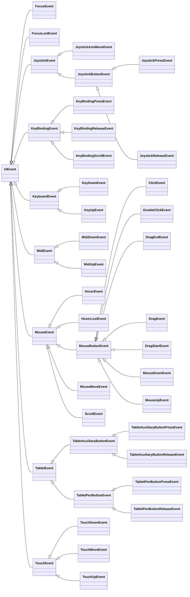

# 入力イベントの処理

入力処理はトポロジー モデルに従い、最上位 (視覚的に) `Drawable`がゲーム内の他のものよりも先に入力を処理します。単一の親子関係の間の階層では、子は親よりも前に入力を処理します。

```
Parent              < Handler #4
    Child_1         < Handler #3
    Child_2         < Handler #2
        Child_2_1   < Handler #1
```

# 位置的入力 vs 非位置的入力

「位置的」入力とは、画面空間の位置に依存する入力 (ホバーなど) を指します。 「非位置的」入力とは、その他の入力 (ボタンの押下など) を指します。

## 個々のイベントハンドラ

### 位置的

```csharp
protected virtual bool OnMouseMove(MouseMoveEvent e);

protected virtual bool OnHover(HoverEvent e);
protected virtual void OnHoverLost(HoverLostEvent e);

protected virtual bool OnMouseDown(MouseDownEvent e);
protected virtual void OnMouseUp(MouseUpEvent e);

protected virtual bool OnClick(ClickEvent e);
protected virtual bool OnDoubleClick(DoubleClickEvent e);

protected virtual bool OnDragStart(DragStartEvent e);
protected virtual void OnDrag(DragEvent e);
protected virtual void OnDragEnd(DragEndEvent e);

protected virtual bool OnScroll(ScrollEvent e);

protected virtual bool OnTouchDown(TouchDownEvent e);
protected virtual void OnTouchMove(TouchMoveEvent e);
protected virtual void OnTouchUp(TouchUpEvent e);

protected virtual bool OnTabletPenButtonPress(TabletPenButtonPressEvent e);
protected virtual void OnTabletPenButtonRelease(TabletPenButtonReleaseEvent e);
```

### 非位置的

```csharp
protected virtual bool OnKeyDown(KeyDownEvent e);
protected virtual void OnKeyUp(KeyUpEvent e);

protected virtual bool OnJoystickPress(JoystickPressEvent e);
protected virtual void OnJoystickRelease(JoystickReleaseEvent e);
protected virtual bool OnJoystickAxisMove(JoystickAxisMoveEvent e);

protected virtual bool OnMidiDown(MidiDownEvent e);
protected virtual void OnMidiUp(MidiUpEvent e);

protected virtual bool OnTabletAuxiliaryButtonPress(TabletAuxiliaryButtonPressEvent e);
protected virtual void OnTabletAuxiliaryButtonRelease(TabletAuxiliaryButtonReleaseEvent e);
```

これらのイベントハンドラーは、単一のイベントを処理する場合に使用する必要があります。

bool値の戻り値は、イベントがシーングラフ内の他の`Drawable`に伝播され続ける必要があるかどうかを示します。

> **例:**
> 子が親に`OnHover()`イベントを受信させたくない場合は、`OnHover()`をオーバーライドして true を返す必要があります。

`OnHoverLost()`は、ホバーされていないすべての`Drawable`に対して無条件に呼び出される例外です。

**例:**
```csharp
protected override bool OnClick(ClickEvent e)
{
    this.ScaleTo(1.25f, 50).Then().ScaleTo(1f, 50);
    return true;
}
```

`OnMouseUp()`、`OnDragEnd()`、`OnKeyUp()`など、前の入力の継続/解決に対応する入力ハンドラーは、true を返すことによって元の入力を処理するように登録されたドローアブルに対してのみ起動します。上記の例では、それは、`OnMouseDown()`、`OnDragStart()`、`OnKeyDown()`などです。これらのイベントは抑制できません。

# 集約イベントハンドラ

```csharp
protected virtual bool Handle(UIEvent e);
```

このイベントハンドラーは、同一の実装を持つイベントのグループを処理する場合に使用する必要があります。

これは、位置的イベントハンドラーと非位置的イベントハンドラーの両方としてカウントされ、以下で説明する`HandleNonPositionalInput`プロパティおよび`HandlePositionalInput`プロパティと組み合わせると適切に機能します。

> **例**
> ```csharp
> protected override bool Handle(UIEvent e)
> {
>     switch (e)
>     {
>         case MouseEvent _:
>             // 他の Drawable によるすべてのマウスイベントの処理を停止します
>             return true;
>
>         default:
>             // 他のすべてを他の Drawable に処理させます
>             return false;
>     }
> }
> ```

# 入力を処理するかどうかの制御

デフォルトでは、上記のハンドラーを実装するすべての`Drawable`は、リストされている入力の種類に適したすべてのイベントを受け取ります。

```csharp
public virtual bool HandleNonPositionalInput;
public virtual bool HandlePositionalInput;
```

上記のプロパティは、`Drawable`が入力イベントのタイプを受け取るかどうかを制御するために提供されます。

> **例:**
> `Drawable`がある時点でクリック、ドラッグ、ホバー イベントを処理したくない場合は、`HandlePositionalInput`をオーバーライドして`false`を返すことでこれを実現できます。

> **警告:**
> 上記のプロパティをオーバーライドすると、`Drawable`はそのタイプの入力に対して考慮されるようになります (ただし、必ずしも受け取る必要はありません)。そのため、`Drawable`がそのタイプの入力に対して考慮されないようにすることが意図されている場合は、最適化対策として機能します。

親が、それ自身またはその子を入力の種類として考慮するかどうかを制御する必要がある場合、動作を制御するために次のプロパティが提供されます:

```csharp
public virtual bool PropagateNonPositionalInputSubTree;
public virtual bool PropagatePositionalInputSubTree;
```

**例:**
```csharp
class MyContainer : FillFlowContainer
{
    public MyContainer()
    {
        for (int i = 0; i < 1024; i++)
            Add(new Button { Size = new Vector2(50) });
    }

    // おっと！追加したボタンは見せかけだけであり、実際にはクリックを処理しません。
    public override bool PropagatePositionalInputSubTree => false;
}
```

# フォーカスの受け取りと処理

```csharp
public virtual bool RequestsFocus;
public virtual bool AcceptsFocus;

protected virtual void OnFocus(FocusEvent e);
protected virtual void OnFocusLost(FocusLostEvent e);
```

フォーカスは、位置的入力と非位置的入力の両方を介して受信できます。 `AcceptsFocus = false`の`Drawable`はフォーカスを受け取りません。

## 位置的

`OnClick()`が`true`を返すと、`Drawable`はフォーカスを受け取ります。

## 非位置的

他にフォーカスがない場合は、`RequestsFocus = true`および`HandleNonPositionalInput = true`の最上位の`Drawable`がフォーカスを受け取ります。

`OnFocusLost()`メソッドは、フォーカスされていない`Drawable`に対して無条件に呼び出されます。

> **例:**
> ```csharp
> class MyDrawable : CompositeDrawable
> {
>     public override bool AcceptsFocus => true;
>     protected override bool OnClick(ClickEvent e) => true;
>
>     protected override void OnFocus(FocusEvent e) => this.ScaleTo(1.5f, 50);
>     protected override void OnFocusLost(FocusLostEvent e) => this.ScaleTo(1f, 50);
> }
> ```

# 入力イベント階層

入力イベントの次の階層関係は、集約イベントハンドラーを使用してドリルダウンするときに知っておくと役立ちます。

