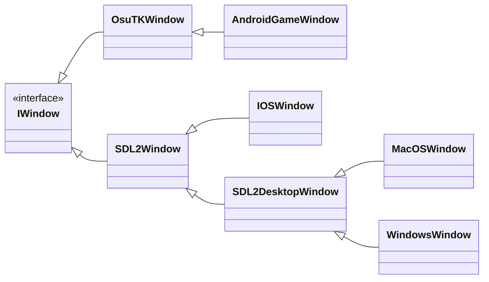

Originally osu!framework used the OpenTK library for windowing, then transitioning to a custom fork of it ([osuTK](https://github.com/ppy/osutk)), and finally moving over to SDL2. The transition is not fully complete; the only platform remaining which is dependent on osuTK is Android.

The class hierarchy currently looks as follows:

- `IOSWindow` contains iOS-specific SDL calls to enable `CADisplayLink` to work for lower latency.
- `MacOSWindow` contains platform-specific code for precise scroll wheel handling.
- `WindowsWindow` contains platform-specific code for DPI awareness, IME, icon setting, and raw input handling.